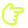

<p align="center">
  <a href="https://zachblevins.com">
    
  </a>
</p>

###  Hey, I'm Blev

Product designer. 15 years in. I design it, then I build it!

Right now I'm the Lead Product Designer at **HubiFi**. I'm the only designer, so I work directly with the co-founders on everything from first sketch to shipped product. Before that I was at PrizePicks, eFuse and DSW.

I do my best work close to the code. Most of what's here is me prototyping in React, building out design systems, and getting motion right.

```ts
const blev = {
  role:        "Lead Product Designer @ HubiFi",
  based:       "Columbus, OH",
  workflow:    "figma → react → prod",
  figmaFiles:  ["Final", "Final v2", "Final ACTUAL", "use this one"],
  spacing:     "multiples of 8 or we fight",
  lorem:       "ipsum, until legal sends the real copy",
};
```

```diff
+ HubiFi       Lead Product Designer     Sole designer. Fintech. 0→1.
+ PrizePicks   Senior Product Designer   20M+ accounts. +56% tailed lineups.
+ eFuse        Senior Product Designer   Led SSO.
+ DSW          UX Designer               Native app and site rebuild.
```

###  Recent commits

```
a3f9c1e  fix: nudge button 1px left
b72e0d4  revert: nudge button 1px left
c18d6a2  chore: rename Final_FINAL_v7.fig to Final.fig
d4e9b05  feat: dark mode (it was always going to be dark mode)
e0a7f13  docs: explain to eng why it's 0.875rem and not 0.8125rem
```

###  Toolbox

<p>
  
</p>
<p>
  
  
  
</p>

###  What I care about

- Prototypes in real code. They answer questions a mockup can't.
- Design systems engineers actually want to use.
- Motion with a purpose. If it doesn't help, it goes.

 Case studies at **[zachblevins.com](https://zachblevins.com)**.

<sub>The header is hand-written SVG. Yes, I kerned it.</sub>
